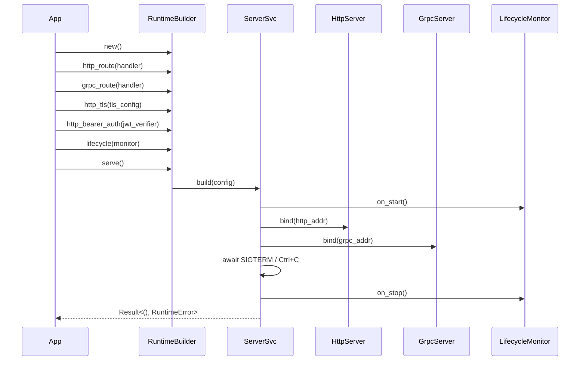
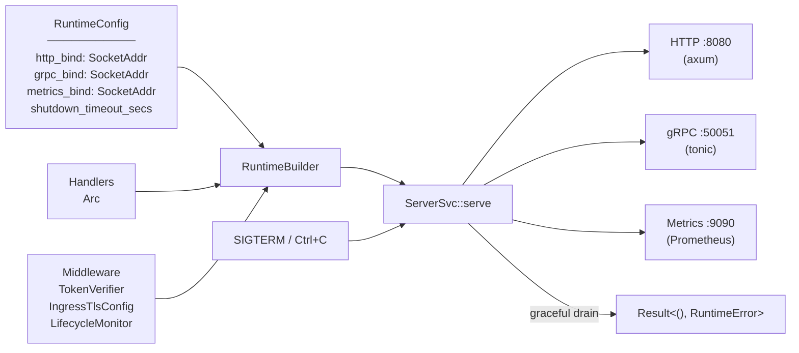
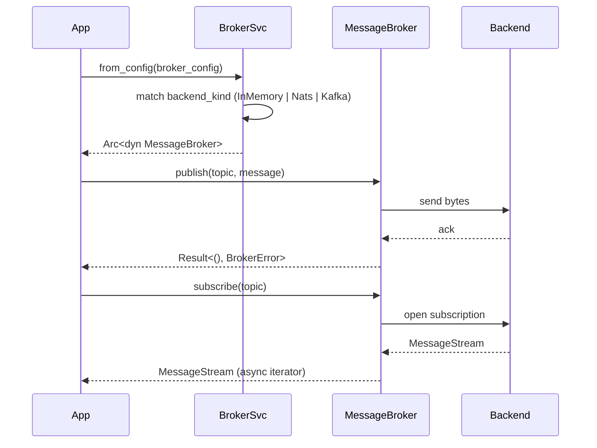
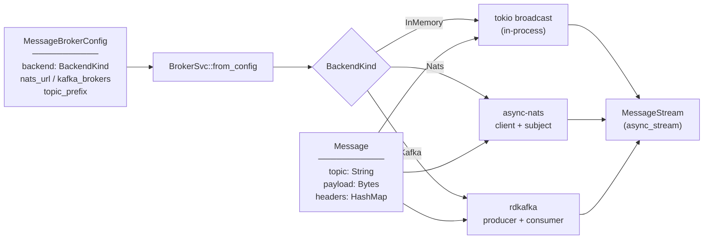

# Architecture — edge-runtime

Two crates: `swe-edge-runtime-server` (HTTP/gRPC runtime assembly) and `swe-edge-runtime-message-broker` (broker backends: in-memory, NATS, Kafka).

---

## Sequence — Runtime Server

> `RuntimeBuilder` is constructed and configured fluently; `serve()` binds ports and blocks until shutdown signal.

## Data Flow — Runtime Server

> Config + handlers enter `RuntimeBuilder`; the assembled runtime exposes three ports and terminates gracefully on signal.

---

## Sequence — Message Broker Backend

> `BrokerSvc::from_config` reads the active backend from TOML and wires it; `publish` and `subscribe` are symmetric.

## Data Flow — Message Broker Backend

> A `MessageBrokerConfig` selects and constructs the backend; messages flow through the backend and emerge as a `MessageStream`.

